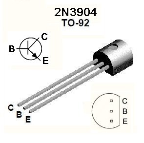

# Microbits Lab
## Programming The Microbit
* Connect the Microbit to the computer using the Micro USB cable.
* Go to https://makecode.microbit.org/
* Here, you'll see The option to write code for your microbit in 2 ways, either with blocks, or using Javascript. The blocks mode is very similar to scratch.
When you're happy with the program you have written, press the download button in the bottom left. After doing this, the code can be dragged onto the microbit in file explorer (Just like a USB stick), and the microbit will run it.

## Activity 1: Using forever Blocks

The first thing that you should get comfortable with is the idea of a "forever" loop. The idea here is that your microbit should do the same thing again and again until you turn it off. You can find the forever instruction under the "basic" tab in makecode. 
In the "basic" tab, you will also find the "show leds" block (alternatively, you could use the "show icon" block). Using these 2 functions, see if you can make your microbit flash on and off with a pattern. 

## Activity 2: Logic and Input

Once you have done this, there is a second thing that would be useful for you to know about. This is called "logic", and itis based on statements that are true or false, for example, is one number bigger than another? These can be found under the "logic" tab in makecode. 

A lot statements that you can use in logic are written the same way that you would talk about them: "and" checks if all of the things are true, "or" checks if atleast one of the things is true, and "not" checks if something is false.

The microbit has 2 buttons, "A" and "B" which give the microbit logic signals, and allow you to interact with it. When you press the button down, it sends a true signal to the microbit, and when the button is not pressed down, it sends false. You can find the blocks to use these buttons in the "input" tab in make code.

Now see if you can modify your code to only show your chosen picture when you press one of the buttons.

## Activity 3: Talking to Another Microbit with Radio
Now you have managed to interact with your microbit using buttons, why not try making it communicate with another microbit?

Here you could try using the "radio" tab in makecode to send messages between 2 microbits. It is important that you run the same code on each microbit so that you can both send and receive messages. Using what you have done previously, can you make an image appear on the LEDs of a different microbit when you press a button, and a different image when you do not? To do this, you will need to use the "on radio receive" block in radio, aswell as the "send number" block, along with your new knowledge of logic.

## Activity 4: Remote Control Robots

 Using what you have done previously, you should now be able to build a remote control robot using 2 microbits, one to control it, and one to control the motors. You will find that the output pins on the Microbit are not powerful enough to control the motors directly. You may have wondered what the small components with 3 pins are for. These are called transistors, and they are very useful in electronics, because they let you produce a large output from a small input.

The 2n3904 transistor:

 
 Above is a diagram of the transistor that you will be using. Notice that one side of the transistor is flat, and the other is curved, this is to help you see which way it is facing. You should connect the pin called the "emitter" (labeled as "E" on the picture) to your motor, the "collector" (labeled as "C" on the picture) to your AA battery pack, and the "base" (labeled as "B" on the picture) to one of the pins on your Microbit (if you're stuck, feel free to ask one of the volunteers, we're happy to help). You should now be able to control a motor using the connections on the Microbit. In order to make a functioning robot, you'll need to wire up 2 transistors like this, one for each motor.

The easiest way for you to use the transistors is to use your breadboard, which is a small black square with holes in it. These are designed so that the holes which are connected run towards the line down the middle of the board. The line in the middle 
 
 Now you have done this, think about how you could make your robot drive in a straight line and steer using the second microbit. 
 
